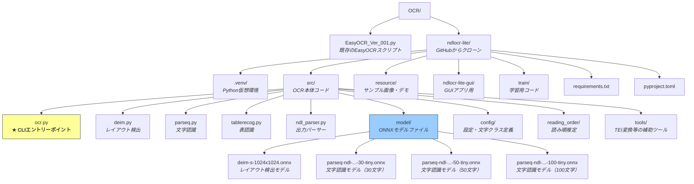
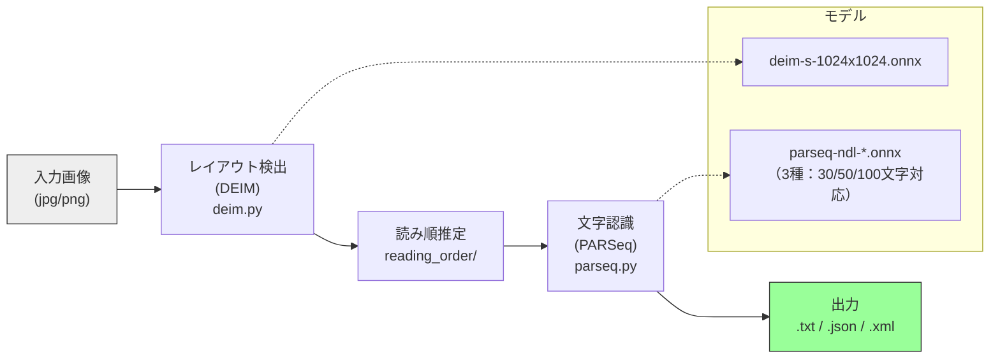

# NDLOCR-Lite 環境構成ガイド

## 概要

国立国会図書館（NDL）が開発・公開したGPU不要の軽量OCRエンジン「NDLOCR-Lite」を、ローカル環境にクローンして使用しています。インターネットAPIは使用しておらず、すべてのOCR処理はローカルのONNXモデルで完結します。

- **公式リポジトリ**: https://github.com/ndl-lab/ndlocr-lite
- **ライセンス**: CC BY 4.0（商用利用可、著作者表示が条件）
- **推論エンジン**: ONNX Runtime（CPU動作、GPUオプションあり）

## 配置パス

```
D:\UserFolders\yukik\Desktop\プログラミング\_自作アプリ\2_メディア処理\OCR\ndlocr-lite\
```

## ディレクトリ構成



## 処理パイプライン



## CLI利用方法

### 基本コマンド（推奨：`uv tool install` 済み）

`uv tool install` によりシステムコマンドとして登録済みのため、**どのディレクトリからでも**、仮想環境を意識せずに実行できます。

```bash
# 単一画像のOCR
ndlocr-lite --sourceimg <画像パス> --output <出力先ディレクトリ>

# ディレクトリ内の画像を一括OCR
ndlocr-lite --sourcedir <画像ディレクトリ> --output <出力先ディレクトリ>
```

コマンド実体は `C:\Users\yukik\.local\bin\ndlocr-lite.exe` にあり、uvが管理する専用の仮想環境で自動的に実行されます。

### 代替方法：仮想環境を直接使用

`uv tool install` を使わない場合は、リポジトリ内の仮想環境を直接指定して実行します。

```bash
PYTHON="D:\UserFolders\yukik\Desktop\プログラミング\_自作アプリ\2_メディア処理\OCR\ndlocr-lite\.venv\Scripts\python.exe"
$PYTHON src/ocr.py --sourceimg <画像パス> --output <出力先ディレクトリ>
```

### 主要オプション

| オプション | 説明 | デフォルト |
|------------|------|-----------|
| `--sourceimg` | 単一画像ファイルのパス | - |
| `--sourcedir` | 画像ディレクトリのパス | - |
| `--output` | 出力先ディレクトリ（**必須、事前に作成が必要**） | - |
| `--viz` | 検出結果の可視化画像を保存 | なし |
| `--device` | `cpu` または `cuda` | `cpu` |
| `--simple-mode` | 単一モデルで認識（低速だが精度がやや向上する場合あり） | `False` |

### 出力形式

1枚の画像から3つのファイルが出力されます。

| 形式 | 内容 |
|------|------|
| `.txt` | 認識テキスト（プレーンテキスト） |
| `.json` | 領域座標・認識テキスト（構造化データ） |
| `.xml` | ALTO形式のOCR結果 |

### 実行例

```bash
# 出力ディレクトリを事前に作成
mkdir "C:\Users\yukik\Desktop\ocr_output"

# 画像1枚をOCR
ndlocr-lite --sourceimg "G:\マイドライブ\Downloads\sample.jpg" --output "C:\Users\yukik\Desktop\ocr_output"

# フォルダ内を一括OCR
ndlocr-lite --sourcedir "G:\マイドライブ\Downloads\images" --output "C:\Users\yukik\Desktop\ocr_output"
```

## 技術的な補足

### ネットワーク接続

OCR処理にネットワーク接続は不要です。初回の `git clone` と `pip install` のみインターネット接続が必要で、以降はオフラインで動作します。

### モデルファイル

ONNXモデルファイルはリポジトリに同梱されており、追加ダウンロードは不要です。

| モデル | 役割 | サイズ目安 |
|--------|------|-----------|
| `deim-s-1024x1024.onnx` | レイアウト検出（テキスト領域・図表領域の識別） | 約20MB |
| `parseq-ndl-*-30-tiny.onnx` | 短い行（30文字以下）の文字認識 | 約15MB |
| `parseq-ndl-*-50-tiny.onnx` | 中程度の行（50文字以下）の文字認識 | 約15MB |
| `parseq-ndl-*-100-tiny.onnx` | 長い行（100文字以下）の文字認識 | 約20MB |

### Python仮想環境

`.venv/` 以下にプロジェクト専用の仮想環境が構築されています。主要な依存パッケージは以下のとおりです。

- `onnxruntime`: 推論エンジン
- `opencv-python-headless`: 画像処理
- `pillow`: 画像読み込み
- `numpy`: 数値計算
- `lxml`: XML出力
- `reportlab`, `pypdfium2`: PDF関連処理
- `tqdm`: 進捗表示
